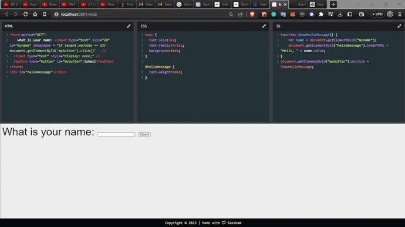
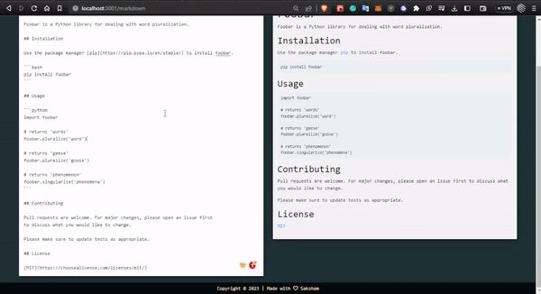

# Editor.io

## Online Code Editor for HTML, CSS, and JavaScript

### Demo

  

### Features:

- No installation required; work online and build web pages easily.
- Auto Save feature to save all your work automatically.
- Supports JQuery library for enhanced functionality.
- Auto-closing of tags and brackets for improved code editing experience.
- Live Preview feature to see your changes in real-time.

## Online Markdown Editor for Generating Readme Files

### Demo

  

## Features

- Supports GitHub Flavored Markdown (GFM) for creating professional-looking Readme files.
- Ability to use HTML tags within the Markdown editor for advanced formatting.
- Custom toolbar to make editing easier with quick access to commonly used formatting options.
- Live Preview feature to see the rendered Markdown file as you type.
- Auto Save feature to automatically save your work as you go.
- Download the generated Readme.md file for easy sharing and distribution.
